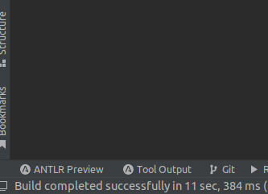
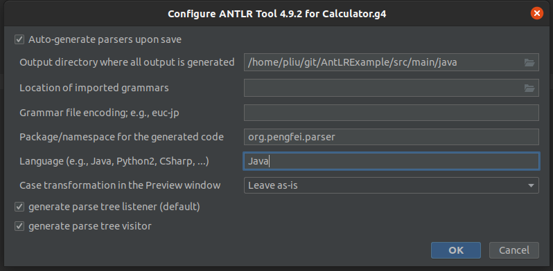

# AntLRExample

In this example, we will use AntLR4 to write a little parser that can calculate simple arithmetic operations (e.g. +,-,*,/)
between integers

## Introduction of AntLR

ANTLR (ANother Tool for Language Recognition) is a powerful parser generator for reading, processing, executing, or 
translating structured text or binary files. It's widely used to build languages, tools, and frameworks. From a 
grammar, ANTLR generates a parser that can build and walk parse trees.

The official site : https://www.antlr.org/

## Create an AntLR project

In this example, I used IntelliJ IDEA as the IDE. You can certainly use other things. So some of the below points may
not compatible with your setup. 

### Step 1. Create a simple java project

### Step 2. Add Maven framework support

### Step 3. Add below dependencies into pom.xml

```xml
<?xml version="1.0" encoding="UTF-8"?>
<project xmlns="http://maven.apache.org/POM/4.0.0"
         xmlns:xsi="http://www.w3.org/2001/XMLSchema-instance"
         xsi:schemaLocation="http://maven.apache.org/POM/4.0.0 http://maven.apache.org/xsd/maven-4.0.0.xsd">
    <modelVersion>4.0.0</modelVersion>

    <groupId>groupId</groupId>
    <artifactId>AntLRExample</artifactId>
    <version>1.0-SNAPSHOT</version>

    <properties>
        <maven.compiler.source>11</maven.compiler.source>
        <maven.compiler.target>11</maven.compiler.target>
    </properties>

    <dependencies>
        <!-- https://mvnrepository.com/artifact/org.antlr/antlr4-runtime -->
        <dependency>
            <groupId>org.antlr</groupId>
            <artifactId>antlr4-runtime</artifactId>
            <version>4.9.3</version>
        </dependency>

    </dependencies>

    <build>
        <plugins>
            <plugin>
                <groupId>org.antlr</groupId>
                <artifactId>antlr4-maven-plugin</artifactId>
                <version>4.9.3</version>
                <executions>
                    <execution>
                        <id>antlr</id>
                        <goals>
                            <goal>antlr4</goal>
                        </goals>
                    </execution>
                </executions>
            </plugin>
        </plugins>

        <!-- Needed so that the mvn test goal finds the ANTLR g4 files. -->
        <resources>
            <resource>
                <directory>src/main/resources</directory>
            </resource>
            <resource>
                <directory>src/main/java/org/pengfei</directory>
                <includes>
                    <include>**/*.g4</include>
                </includes>
            </resource>
        </resources>
    </build>
    
</project>
```

### Step 4. Add Antlr IntelliJ plugin

After installation of this plugin, you should see an icon `ANTLR Preview` on the bottom left of the IDE. Below figure is
an example. 



### Step 5. Edit the grammar of the language you want to parse

Antlr4 has a specific file format to store grammar (i.e. .g4)

In our example, we want to build a calculator for integer arithmetic operations. Below is an example of the grammar (Calculator.g4)

```antlrv4
grammar Calculator;

start : expr ;

expr  : left=expr op=('*'|'/') right=expr #opExpr
      | left=expr op=('+'|'-') right=expr #opExpr
      | '(' expr ')'                      #parenExpr
      | atom=INT #atomExpr
      ;

INT   : ('0'..'9')+ ;

WS    : [ \t\r\n]+ -> skip ;
```

- line 1: `start` means the beginning of your language expression (aka. root node of the syntax tree). `expr` is the main statement of your language
- line 3: `expr` has four possible form:
    - `left` (*|/) `right` where left and right are also `expr`
    - `left` (+|-) `right` where left and right are also `expr`
    - ( expr )
    - atom: is the minimal element in your language which is a token INT.
- line 5: define token INT, is a digits
- line 7: define token WS, is white space that the parser can skip

### Step 6 Configure the Antlr plugin

Open your grammar file, in our case it's the `Calculator.g4`. Right-click on the code source page. You should see a list
of action. You should see three actions related to Antlr plugin
1. Configure Antlr
2. Generate Antlr Recognizer
3. Test rule <name>

First, we need to configure Antlr to specify how to generate the recognizer. Click on the `Configure Antlr` action, you
should see below pop up window.



You need to edit below three options:
- path of the output Antlr Recognizer
- package/namespace of the output Antlr Recognizer
- language of the Recognizer

### Step 7 Generate the Recognizer

After the configuration, you can start the generation by right-clicking on .g4 and choose action `Generate Antlr Recognizer`.
You should see the following output in the org.pengfei.parser 
```text
└── org
    └── pengfei
        ├── grammar
        │   └── Calculator.g4
        └── parser
            ├── CalculatorBaseListener.java
            ├── CalculatorBaseVisitor.java
            ├── Calculator.interp
            ├── CalculatorLexer.interp
            ├── CalculatorLexer.java
            ├── CalculatorLexer.tokens
            ├── CalculatorListener.java
            ├── CalculatorParser.java
            ├── Calculator.tokens
            ├── CalculatorVisitor.java
            ├── Main.java
            └── MyCalcVisitor.java

```

### Step 8: Listener vs Visitor

By default, Antlr provides two patterns (e.g. Listener, visitor) to allow you to traverse the parsed syntax tree. This [doc](https://saumitra.me/blog/antlr4-visitor-vs-listener-pattern/)
explains the difference between the two patterns.

In general, If you plan to directly use the parser output for interpretation, the `visitor` is a good choice. You have 
full control of the traversal, so in conditionals only one branch is visited, loops can be visited n times and so on.

But beware, a visitor uses the `call stack` to manage tree traversals, whereas the listener uses an explicit `stack 
allocated on the heap`, managed by a walker. This means that large inputs to a visitor could blow out the stack, 
while a listener would have no trouble.

In this example, we use visitor to process the parser output.

### Step 9: Implement the BaseVisitor

We can process the parser output by implementing the CalculatorBaseVisitor. To make the architecture clean, we never directly
modify the CalculatorBaseVisitor, we create a new class that extends the BaseVisitor. This allows you to have multiple
implementation of the parser.

In our case, we create a class called MyCalcVisitor that extends CalculatorBaseVisitor. In this class, we override all
methods. 

The main functions of these methods is to treat the output of the parsed tree. Each method correspond a node in the tree.
When a node is visited, the corresponding method will be called. For example, for a expression `4*(1+2)`, you will have
a tree as shown below:


4 is a `atomExpr`, when 4 is visited, the method `visitAtomExpr` will be called. Each visitor will return a value or
call visit on another expression. At the end, Antlr will sum up the result and return the final result 
For more detail on how to override methods, check `MyCalcVisitor.java`.

### Step 10: Unit Test your parser

To ensure you parser does exactly what you want, you should always test your parser. In this example, we use **Junit and 
AssertJ** to test. For more details, please check


### Step 11: Debug and preview the syntax tree

If the language that you want to parse is complex, and you can find a bug. The best way is to use the preview of the
parsed syntax tree. Follow the visitor, for each node visited, check the output of the corresponding visitor method.

Note this is provided by the antlr idea plugin, if you don't have it. Skip the follow paragraph. 

To enable the `Antlr preview`, open your .g4 file, right-click on the opened file, on the popup page, you should see 
an action Test rule <name>, where name is the name that you give to the root node of your grammar. In our example, it's
called start.

Then click on ANTLR Preview, write your expression on the bottom left, you should see the generated tree on the bottom right.
Below figure is an example


